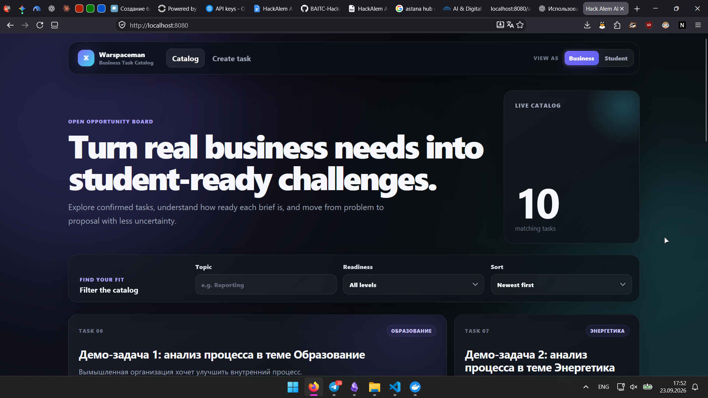
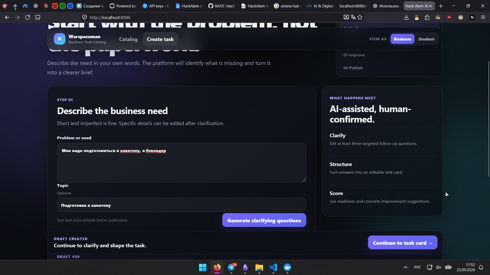
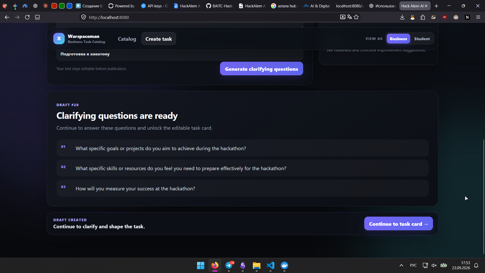
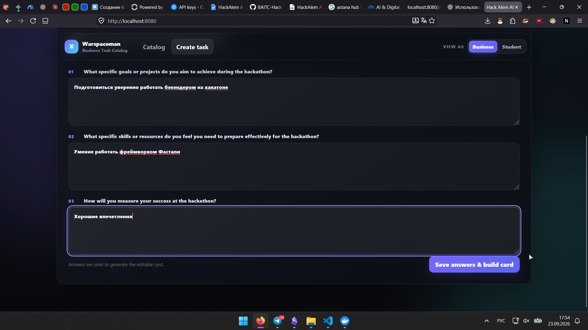
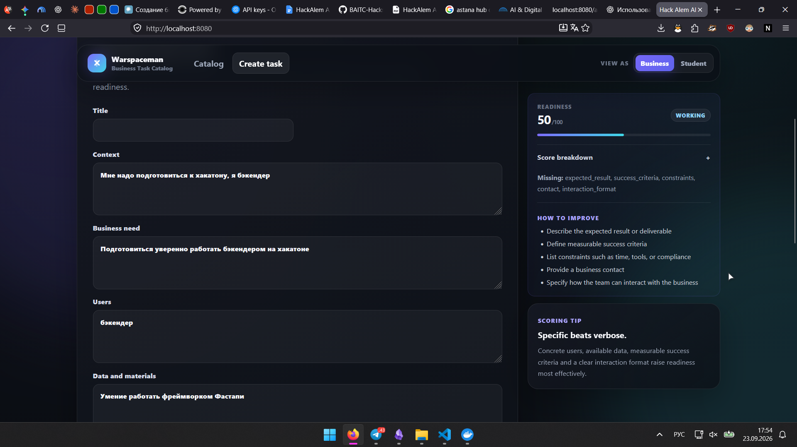
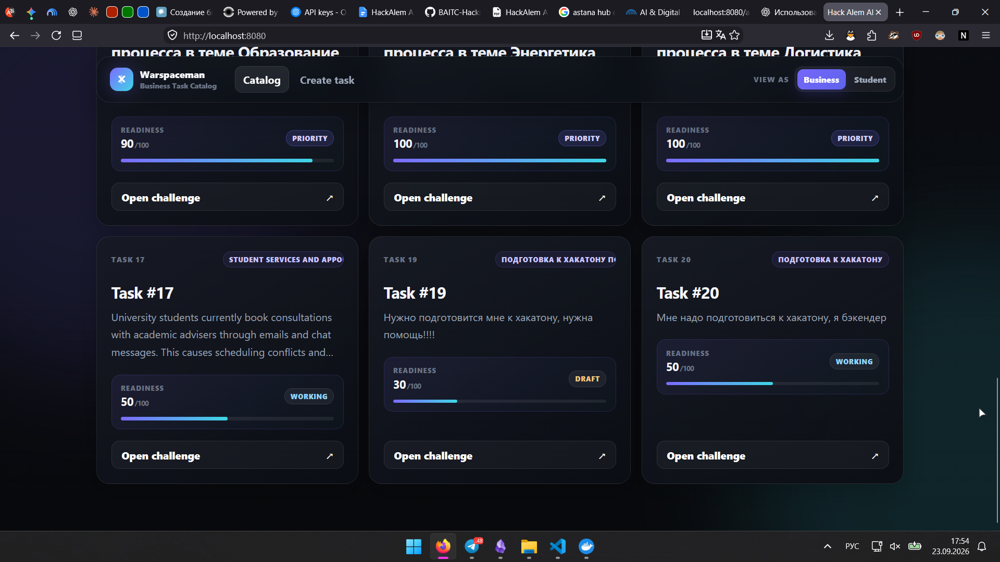

# BriefForge

> **Turn a vague business request into a clear, rated, student-ready challenge.**

BriefForge is an AI-assisted platform that turns vague business needs into structured, rated challenges for student teams. The platform uses AI-assisted clarification, creates an editable task card, calculates a transparent readiness score from 0 to 100, publishes confirmed challenges to a shared catalog, and lets businesses manually review student proposals.


---

## Product Preview



The catalog contains confirmed business challenges with visible readiness scores. Tasks remain available even when their descriptions are incomplete, allowing students to understand how much clarification may still be required before starting work.

The platform uses four readiness levels:

- **Draft** — 0–39
- **Working** — 40–69
- **Ready** — 70–89
- **Priority** — 90–100

---

## The Problem

Business challenges often begin as short and incomplete descriptions.

A student team may not immediately know:

- who will use the solution;
- what data or materials are available;
- what result is expected;
- what constraints apply;
- how success should be measured;
- how the team can communicate with the business.

This means students spend time clarifying the task before they can actually start solving it.

---

## Our Solution

BriefForge turns a weak business brief into an actionable challenge through one complete workflow:

```text
Business need
     ↓
AI clarification
     ↓
Editable task card
     ↓
Readiness score
     ↓
Improve missing information
     ↓
Publish to catalog
     ↓
Student proposal
     ↓
Manual business decision
```

AI assists with clarification and structuring, but the business user always remains in control of the final task.

---

## 1. Start with a Weak Business Brief



The business starts by entering a short problem description in ordinary language.

The description does not need to be complete or perfectly structured. A topic can optionally be provided to give the AI additional context.

This keeps the first step simple: describe the actual problem first, then improve the task through clarification.

---

## 2. AI-Assisted Clarification



The ML service returns **exactly three targeted clarification questions**.

The questions are designed to identify information that is missing from the initial business request and make the challenge more actionable for students.

The ML service supports two modes:

- **OpenAI provider mode** when an API key is configured;
- **deterministic rule-based fallback** when no provider key is available.

This means the main workflow can continue even if the external AI provider is unavailable.

The system does **not** automatically publish AI-generated content. The business reviews and controls the final task.

---

## 3. Human Answers Become Evidence



The business answers the generated questions directly in the interface.

These answers are stored together with their original questions and are used to construct the editable task card.

The AI is not allowed to silently invent business facts. Generated information is based on the user's supplied description and answers, and the result remains editable before publication.

---

## 4. Readiness Scoring and Improvement



After clarification, the platform creates an editable task card and calculates its readiness.

The interface shows:

- current readiness score;
- readiness level;
- score breakdown;
- missing information;
- concrete improvement suggestions;
- editable task fields.

The screenshot above shows a task with a score of **30/100**, clearly indicating which information is still missing.

### Rating Formula

The numeric rating is deterministic backend logic. It is **not generated by the language model**.

| Category | Points |
|---|---:|
| Context + business need | 20 |
| Data and materials | 20 |
| Expected result | 15 |
| Success criteria | 15 |
| Constraints | 10 |
| Users | 10 |
| Contact + interaction format | 10 |
| **Total** | **100** |

### Readiness Levels

| Score | Level |
|---:|---|
| 0–39 | Draft |
| 40–69 | Working |
| 70–89 | Ready |
| 90–100 | Priority |

A low rating does not hide a confirmed challenge. It communicates how prepared the task currently is and what should be improved.

---

## 5. Task Quality Becomes Visible in the Catalog



The catalog can contain challenges at different preparation levels.

For example:

```text
20/100  → Draft
55/100  → Working
70/100  → Ready
90/100  → Priority
100/100 → Priority
```

This is the central gamification mechanic of the project:

```text
More useful task information
          ↓
Higher readiness score
          ↓
Clearer challenge for students
```

The score evaluates the **quality and completeness of the task**, not the popularity or reputation of the company that submitted it.

---

## Student Choice

Student teams can browse published challenges and decide for themselves which task they want to work on.

They can:

- browse the complete catalog;
- filter by topic;
- filter by readiness level;
- sort by readiness score;
- inspect the complete task brief;
- create or select a team;
- submit a proposal.

A proposal can contain:

- solution idea;
- implementation plan;
- deadline;
- prototype link.

The platform does **not** automatically assign teams to businesses.

---

## Business Decision

After proposals are submitted, the business can review them manually.

For each proposal, the business can:

- **Accept**
- **Reject**

The final decision always remains with the business representative.

AI never automatically chooses the winning team.

---

## End-to-End Workflow

The implemented workflow is:

```text
Draft
→ 3 clarification questions
→ Answers
→ Editable task card
→ Readiness score
→ Improvement
→ Publication
→ Catalog
→ Student proposal
→ Manual business decision
```

This flow was exercised through the running Docker application rather than simulated with presentation slides.

---

## Architecture

```text
Browser
   │
   ▼
React + Vite
Nginx
   │
   │ /api
   ▼
FastAPI Backend
   │
   ├── SQLAlchemy
   ├── SQLite
   ├── Deterministic Rating Service
   │
   └──── HTTP ────► FastAPI ML Service
                         │
                         ├── OpenAI provider mode
                         └── Rule-based fallback
```

Docker Compose runs three application services:

```text
frontend
backend
ml
```

The backend stores data in SQLite using a persistent Docker volume.

---

## Tech Stack

| Layer | Technologies |
|---|---|
| Frontend | React, Vite, JavaScript, CSS, Nginx |
| Backend | Python, FastAPI, SQLAlchemy, SQLite, Pydantic, HTTPX |
| AI / ML | Python, FastAPI, OpenAI structured output, deterministic fallback |
| Infrastructure | Docker, Docker Compose |

---

# Run BriefForge

The easiest way to run the complete project is Docker Compose.

### Requirements

- Git
- Docker Desktop

### Clone

```powershell
git clone https://github.com/XEQU4/briefforge.git
cd briefforge
```

### Start

```powershell
docker compose up --build -d
```

Open:

```text
http://localhost:8080
```

### Check Services

```powershell
docker compose ps
```

Expected application services:

```text
frontend
backend
ml
```

### View Logs

```powershell
docker compose logs -f frontend backend ml
```

### Stop

```powershell
docker compose down
```

The SQLite database is stored in a persistent Docker volume and survives a normal shutdown.

> Do not run `docker compose down -v` unless you intentionally want to delete the persistent demo database.

---

## Optional OpenAI Mode

BriefForge can run without an OpenAI API key using the deterministic ML fallback.

To enable provider-backed AI generation, copy the example environment file:

```powershell
Copy-Item .env.example .env.local
```

Then configure your local values:

```env
FRONTEND_PORT=8080
OPENAI_API_KEY=your_key_here
OPENAI_MODEL=gpt-4o-mini
```

Launch using:

```powershell
docker compose --env-file .env.local up --build -d
```

Never commit real API keys.

---

# Verification

## Development checks

Docker Compose uses PostgreSQL as the primary local development database.
`docker compose up --build -d` starts PostgreSQL and runs the one-shot
`migrate` service (`alembic upgrade head`) before starting the backend. The
PostgreSQL data is kept in the `postgres-data` named volume.

To run migrations manually, from the repository root:

```sh
docker compose run --rm migrate
```

Or from `backend/` with `DATABASE_URL` configured:

```sh
alembic upgrade head
alembic current
alembic history
```

Run each command from its service directory:

Backend (`backend/`):

```sh
python -m unittest discover -s tests -v
```

Frontend (`frontend/`):

```sh
npm ci
npm run build
```

ML (`ml/`):

```sh
python -m pytest
```

Compose validation (repository root):

```sh
docker compose config --quiet
```

## Backend Regression Tests

The backend regression suite was executed inside the Docker Linux environment:

```powershell
docker compose run --rm --no-deps backend python -m unittest discover -s tests -v
```

Verified result:

```text
Ran 10 tests
OK
```

The suite covers:

- complete task lifecycle;
- clarification answer normalization;
- rating boundaries and breakdown;
- invalid state transitions;
- proposal creation and decisions;
- ML failure fallback;
- demo dataset behavior;
- demo-admin access protection.

---

## Live Integration

The complete browser flow produced successful backend requests for:

```text
POST  /tasks
PATCH /tasks/{id}/answers
GET   /tasks/{id}/rating
PATCH /tasks/{id}
POST  /tasks/{id}/confirm
GET   /tasks

POST  /teams

POST  /tasks/{id}/proposals
GET   /tasks/{id}/proposals
PATCH /proposals/{id}
```

The running ML service also successfully handled:

```text
POST /generate-questions
POST /form-card
```

This confirms service-to-service integration in the running application.

It is not intended as a comprehensive benchmark of AI model quality.

---

## Demo Data

For local testing, the project includes private demo tooling that can populate the application with synthetic data.

The demo catalog contains examples at several readiness levels:

```text
20  → Draft
55  → Working
70  → Ready
80  → Ready
90  → Priority
100 → Priority
```

This makes it possible to demonstrate catalog ordering and the readiness gamification mechanic without using real business data.

---

# 5-Minute Jury Demo

A complete demo can be shown in one prepared scenario.

### 1. Show the Catalog

Show business challenges with different readiness levels.

### 2. Switch to Business

Create a deliberately weak task description.

### 3. Generate Clarification Questions

Show the three AI-assisted questions.

### 4. Answer the Questions

Provide missing details.

### 5. Review the Editable Card

Show the initial readiness score and missing fields.

### 6. Improve the Task

Add missing information and press:

```text
Save & recalculate
```

Show the score increasing.

### 7. Publish

Publish the challenge to the common catalog.

### 8. Switch to Student

Open the challenge.

Create or select a team and submit a proposal.

### 9. Switch Back to Business

Review the proposal.

### 10. Make the Decision

Accept or reject the proposal manually.

This demonstrates the entire task-to-team workflow in BriefForge.

---

## API Contract

The service interface is documented in:

[docs/API_CONTRACT.md](docs/API_CONTRACT.md)

This file is the source of truth for endpoint paths and request/response formats.

---

## Repository Structure

```text
.
├── frontend/             React/Vite application
├── backend/              FastAPI API, database, rating and proposals
├── ml/                   clarification and task-card AI service
├── docs/
│   ├── API_CONTRACT.md
│   └── screenshots/
├── docker-compose.yml
└── README.md
```

---

## Current Scope

The current implementation does not include:

- production authentication;
- password recovery;
- realtime chat;
- notifications;
- file storage;
- payment;
- automatic team assignment;
- full project management;
- production deployment infrastructure.

The implementation covers an end-to-end workflow from a raw business need to a student proposal and a manual business decision.

---

## Core Principle

The platform does not rank companies.

It measures how ready a **specific business task** is for students to work on.

The better the task is described, the clearer it becomes for student teams — and the higher its readiness score.

## Origin

BriefForge originated as a Hack Alem prototype.
