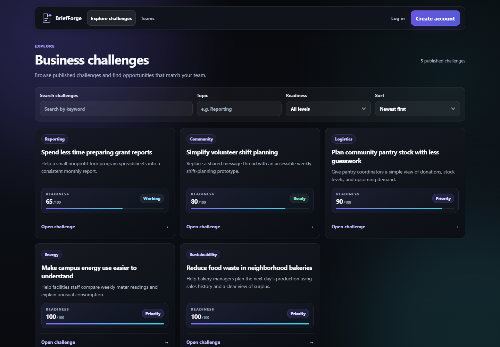
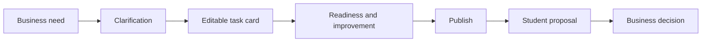
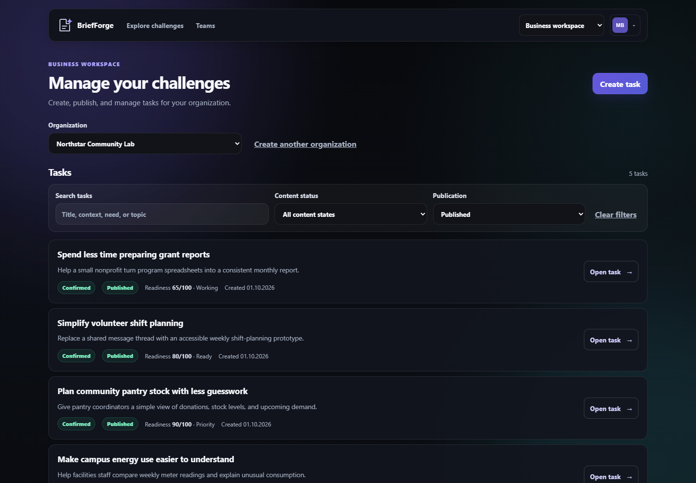
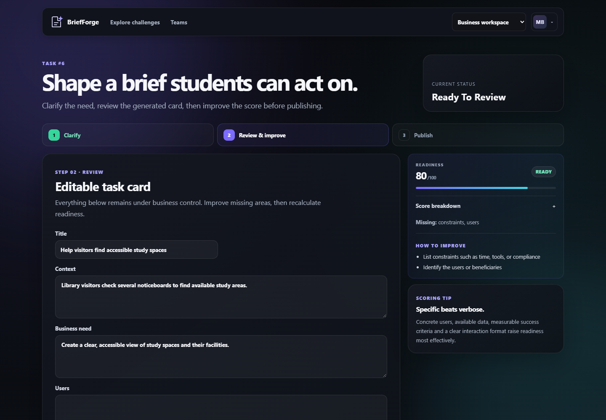
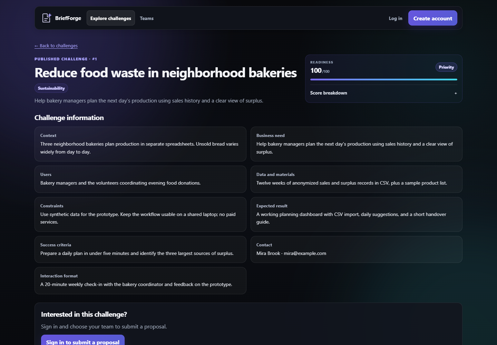
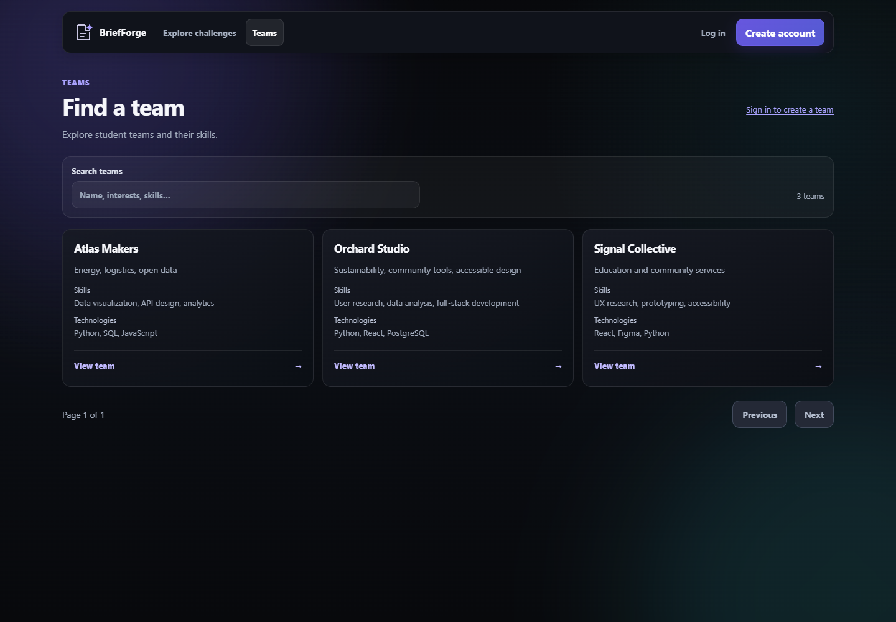
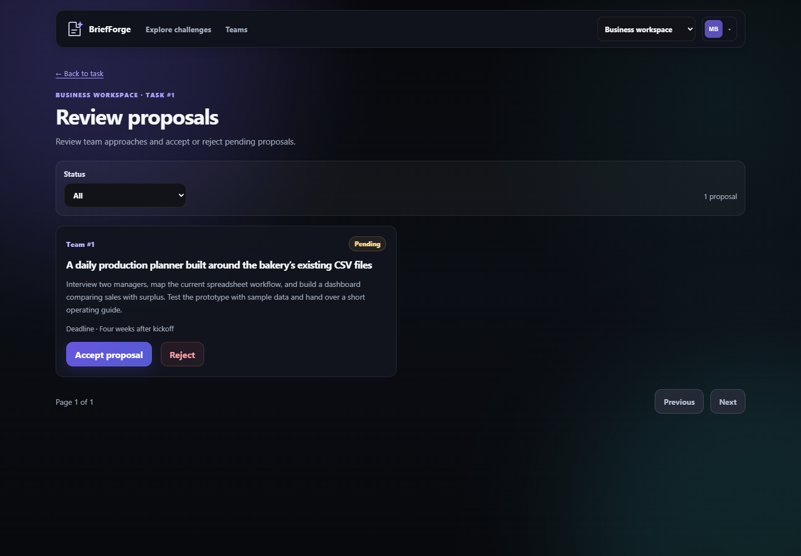
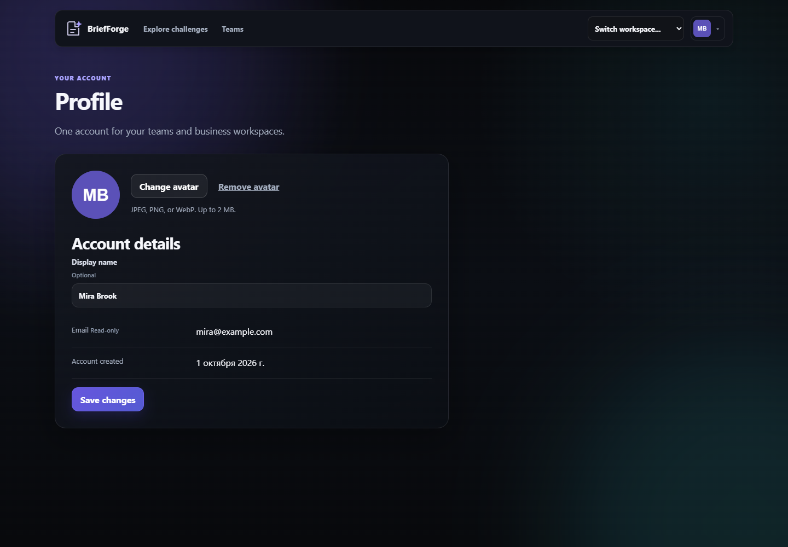
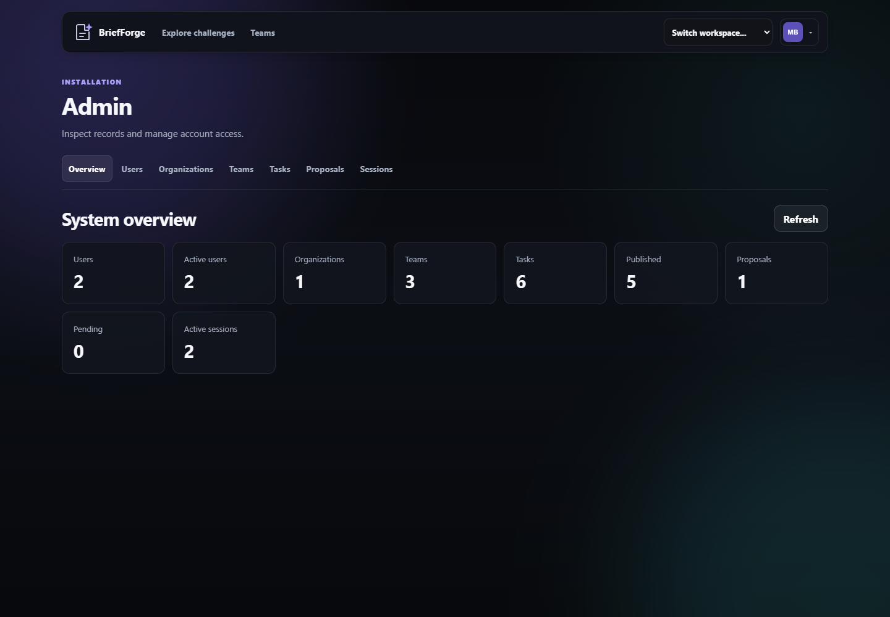
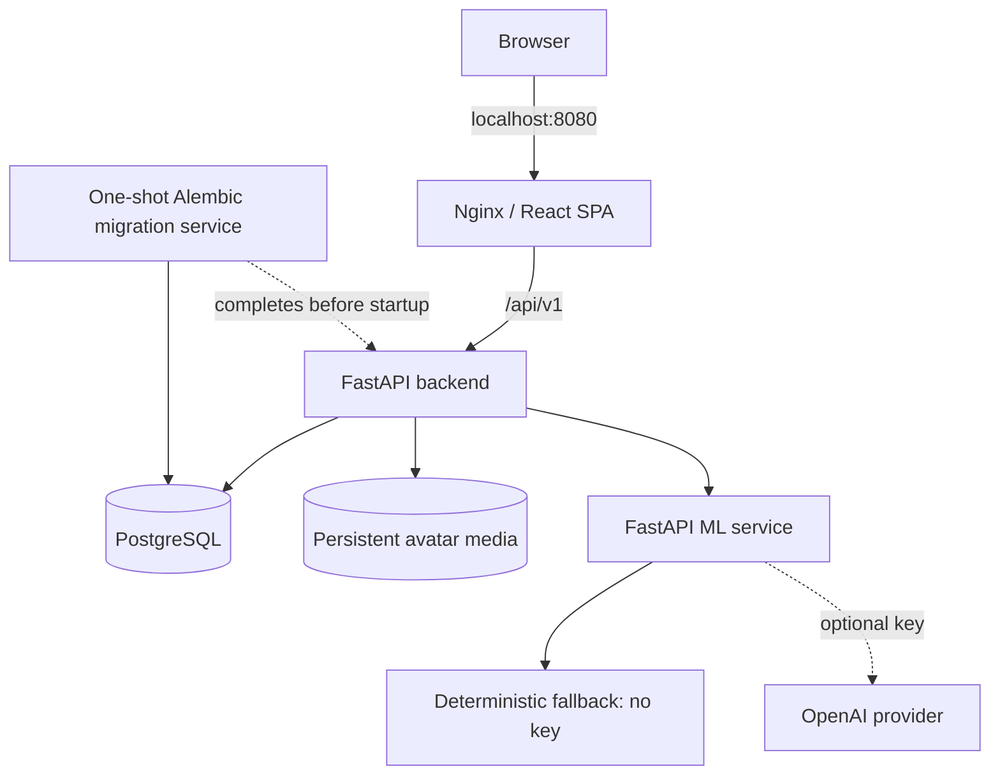

# BriefForge

**Turn vague business needs into structured, student-ready challenges.**

[](https://github.com/XEQU4/briefforge/actions/workflows/ci.yml)


[](LICENSE)

Businesses clarify a need, improve an editable brief using a transparent readiness score, and publish it. Student teams browse challenges and propose solutions; businesses review those proposals and make the final decision.



## Why BriefForge

A short business request often leaves students guessing about users, available data, constraints, and success criteria. BriefForge makes those gaps visible before a team starts work. Clarification helps structure the brief; people remain responsible for its content and decisions.

## Features

- **Business:** organization workspaces, three targeted clarification questions, resumable drafts, editable task cards, readiness guidance, publication controls, and manual proposal review.
- **Students:** public challenge and team catalogs, team creation, proposal submission, and proposal history.
- **Account:** session authentication, editable display name, and validated avatar uploads with persistent storage.
- **Operations:** a session-protected admin panel, account activation/deactivation, session revocation, migrations, health endpoints, and CI.
- **AI assistance:** optional OpenAI generation or a conservative deterministic fallback with no API key. Unsupported card details remain unknown rather than being silently filled in.

Readiness is calculated by backend rules, not by the language model. The 100-point score covers context/need (20), data (20), expected result (15), success criteria (15), constraints (10), users (10), and contact/interaction format (10). Levels are Draft (0–39), Working (40–69), Ready (70–89), and Priority (90–100). It measures brief completeness, not company reputation or solution quality.

## Product workflow


```mermaid
flowchart LR
    A[Business need] --> B[Clarification]
    B --> C[Editable task card]
    C --> D[Readiness and improvement]
    D --> E[Publish]
    E --> F[Student proposal]
    F --> G[Business decision]
```

## Screenshots

Current desktop views use fictional organizations, accounts, and projects.

<details>
<summary>Workspace, editor, proposals, profile, and admin</summary>

| Business workspace | Editable card and readiness |
| --- | --- |
|  |  |
| Public challenge | Team directory |
|  |  |
| Proposal review | Profile and avatar |
|  |  |



</details>

## Architecture


```mermaid
flowchart TD
    Browser -->|localhost:8080| Frontend[Nginx / React SPA]
    Frontend -->|/api/v1| Backend[FastAPI backend]
    Backend --> Database[(PostgreSQL)]
    Backend --> Media[(Persistent avatar media)]
    Backend --> ML[FastAPI ML service]
    ML --> Fallback[Deterministic fallback: no key]
    ML -. optional key .-> OpenAI[OpenAI provider]
    Migrate[One-shot Alembic migration service] --> Database
    Migrate -. completes before startup .-> Backend
```

Compose runs four long-lived services (`frontend`, `backend`, `ml`, `postgres`) and a one-shot `migrate` service. PostgreSQL uses the `postgres-data` volume; avatars use `media-data`. Only Nginx is published to the host, bound to `127.0.0.1`. Backend readiness checks database connectivity; Compose waits for PostgreSQL and migrations before starting the backend, then starts the frontend after backend readiness. ML has its own health check.

## Tech stack

| Layer | Technologies |
| --- | --- |
| Frontend | React 19, Vite 8, React Router 7, CSS, Nginx; Node 22 for builds |
| Backend | Python 3.12, FastAPI, SQLAlchemy, Pydantic, Alembic, PostgreSQL 18, Argon2 |
| ML | FastAPI, optional OpenAI provider, deterministic fallback |
| Infrastructure | Docker, Docker Compose, GitHub Actions |

## Quick start

Install Git and Docker with the Compose plugin (Docker Desktop with Linux containers on Windows/macOS). No API key or environment file is required. The first build downloads dependencies.

```sh
git clone https://github.com/XEQU4/briefforge.git
cd briefforge
docker compose up -d --build
docker compose ps
```

Open **[http://localhost:8080](http://localhost:8080)** once the four services are healthy. The `migrate` container should exit successfully; inspect it with `docker compose ps -a` if needed. Register an account, open **Business workspace**, create an organization, and start a challenge. The fresh catalog is empty until a challenge is published.

```sh
docker compose logs -f
docker compose down
```

Normal shutdown and container recreation preserve database records and avatars. To deliberately reset this installation:

```sh
docker compose down -v
```

**Warning:** `-v` deletes this Compose project's PostgreSQL and avatar volumes, including accounts, tasks, proposals, and uploaded avatars.

## Administrator setup

Start the app and register a normal account through the UI. From the repository root, promote that existing account:

```sh
docker compose exec backend python scripts/set_admin.py user@example.com
```

Refresh the browser and choose **Admin** in the account menu, or visit `/admin`. There are no default administrator credentials. Promotion is idempotent; it needs no container rebuild. To explicitly remove administrator access:

```sh
docker compose exec backend python scripts/set_admin.py user@example.com --remove
```

The CLI can demote the operator's own account. The web panel cannot promote/demote administrators, deactivate the current account, or revoke its own sessions.

### Optional demo data

The separate, disabled-by-default `/admin/demo` utility seeds a fixed synthetic catalog using an opt-in Compose overlay and a locally generated token. Through Nginx it is reached at `/api/admin/demo`. It does not grant real admin access or create login credentials. These legacy demo records are unowned; use normal registration and organization/team creation to demonstrate the authenticated workflow. See [local demo instructions](backend/README.md#private-local-demo-admin).

## Optional OpenAI mode

Create an optional root `.env` file. You can copy `.env.example` using `copy .env.example .env` in Windows CMD or `cp .env.example .env` in a POSIX shell. Set `OPENAI_API_KEY` locally, optionally change `OPENAI_MODEL`, then run:

```sh
docker compose up -d
```

Compose reads `.env` automatically and recreates services whose configuration changed. Leave `OPENAI_API_KEY=` empty for deterministic generation without external AI calls. Configured provider requests may incur charges. Provider failures produce controlled ML errors; the backend can continue with its own deterministic fallback. Generated content still needs human review. See [ML behavior and evaluation](ml/README.md).

## Configuration

[.env.example](.env.example) is the reference for the standard Compose setup. Shell variables override `.env` values.

| Variable | Local default | Purpose |
| --- | --- | --- |
| `FRONTEND_PORT` | `8080` | Browser port on localhost |
| `POSTGRES_DB` | `briefforge` | Initial database name |
| `POSTGRES_USER` | `briefforge` | Local database user |
| `POSTGRES_PASSWORD` | `briefforge_local_dev` | Local-only database password |
| `SESSION_COOKIE_NAME` | `briefforge_session` | Session cookie name |
| `SESSION_TTL_SECONDS` | `604800` | Session lifetime (7 days) |
| `SESSION_COOKIE_SECURE` | `false` | Set `true` when serving over HTTPS |
| `OPENAI_API_KEY` | empty | Optional; empty selects deterministic fallback |
| `OPENAI_MODEL` | `gpt-4o-mini` | Model used when a key is configured |

PostgreSQL initialization settings apply when its volume is first created; changing the password in `.env` does not change an existing database user's password. Compose constructs the database URL and media path internally. Advanced external-database/local-service setup is described in [backend/README.md](backend/README.md). Never commit `.env` or real credentials.

## Testing

Use Python 3.12 and Node 22. Run these blocks separately from the repository root, with Python dependencies installed in an activated virtual environment:

```sh
cd backend
python -m pip install -r requirements.txt
python -m unittest discover -s tests -v
```

```sh
cd ml
python -m pip install -r requirements-dev.txt
python -m pytest
```

```sh
cd frontend
npm ci
npm run build
```

From the repository root:

```sh
docker compose config --quiet
docker compose run --rm --no-deps backend python -m unittest discover -s tests -v
```

Backend tests use temporary SQLite databases and mocked ML transports; ML tests mock provider calls. No paid key is needed. GitHub Actions runs backend tests, frontend builds, ML tests, Compose validation, and PostgreSQL migration/locking checks. The production ML image intentionally omits development test dependencies.

## Project structure

```text
backend/            API, auth, scoring, admin, migrations, tests
frontend/           React application and Nginx proxy
ml/                 Clarification/card service and offline evaluations
docs/               API contract, release notes, screenshots
.github/workflows/  Continuous integration
.env.example        Optional local Compose configuration
docker-compose.yml  Services and persistent volumes
LICENSE             MIT license
```

## Security notes

Authentication uses opaque server-side sessions, Argon2 password hashing, and an HttpOnly session cookie. Unsafe authenticated requests require CSRF validation. The backend enforces workspace membership and administrator access. Avatar uploads are size/type/dimension checked, re-encoded, and stored under server-generated names; admin APIs omit password and session/CSRF hashes and disable caching.

This is a portfolio/local-deployment project, not a claim of independently audited production security. Keep the local defaults on localhost. Internet deployment requires your own HTTPS, secure cookies, credential management, backups, and operational review. Avatar storage and database volumes both need backup.

## API documentation

[API_CONTRACT.md](docs/API_CONTRACT.md) documents routes, schemas, authorization, and lifecycle rules. The browser uses `/api/v1`; unversioned product aliases remain for compatibility. Real admin endpoints are v1-only. Health is available through Nginx at `/api/health/live` and `/api/health/ready`.

## Known limitations

- No password recovery, email verification/change, or OAuth.
- No notifications, realtime messaging, or invitation workflow.
- Avatars use a local Docker volume rather than object storage.
- No bundled cloud deployment, TLS termination, or automated backup configuration.
- Deterministic fallback is intentionally conservative; unknown/ambiguous evidence can require manual card edits. Readiness does not validate business feasibility or AI accuracy.
- Workspace lists show stored readiness; an unconfirmed card can show 0 there until confirmation. The editor loads the current calculated rating.

See the prepared [v1.0.0 release notes](docs/RELEASE_NOTES_V1.md).

## Origin

BriefForge began as a Hack Alem prototype and was developed into this standalone project.

## License

[MIT](LICENSE) · Copyright © 2026 XEQU4.
